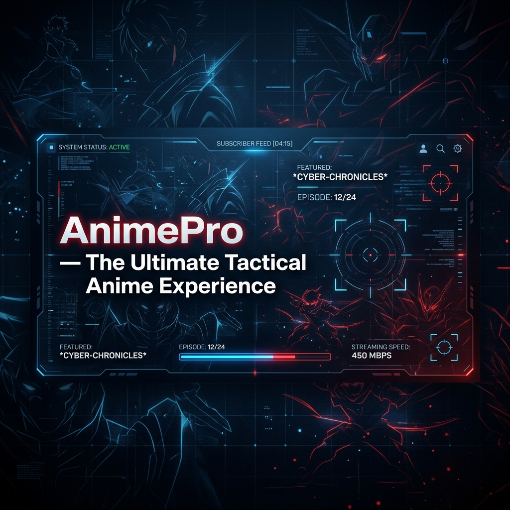

# 

<div align="center">

# 🌌 **AnimePro — The Ultimate Tactical Anime HUD**
### **Next-Gen Anime Streaming. Tactical UI. Universal Sync.**

[](https://svelte.dev)
[](https://go.dev)
[](https://capacitorjs.com)
[](https://electronjs.org)

</div>

---

## 🚀 **Overview**

**AnimePro** is a high-performance, open-source anime streaming ecosystem built for speed, aesthetics, and cross-platform mastery. Designed with a **Tactical HUD** philosophy, it provides a cinematic experience whether you are on a mobile device, a desktop, or a browser. 

Featuring **Incremental Parallel Loading**, AnimePro starts your video faster than any other application by racing multiple providers and launching the first available stream instantly.

---

## 🔥 **Elite Features**

### ⚡ **Hyper-Fast Streaming**
*   **Parallel Source Racing**: Queries multiple providers simultaneously and starts playback the *nanosecond* the first source arrives.
*   **0-Wait Logic**: Background sources continue to populate without interrupting your current stream.
*   **Smart Auto-Selection**: Automatically picks your preferred language (Hindi/English/Sub) from the fastest provider.

### 📱 **Native Android Supremacy**
*   **Java-Native Bridge**: Deep integration with Android for orientation locking and system-level performance.
*   **Background Downloads**: Native `DownloadManager` support to save your favorite episodes for offline viewing.
*   **Responsive Scaling**: Perfect adaptation for Android TVs, Tablets, and Foldables.

### 🛰️ **Tactical HUD Interface**
*   **Glassmorphism Design**: A stunning, semi-transparent UI that feels futuristic and premium.
*   **Micro-Animations**: Smooth Svelte-powered transitions that make every interaction satisfying.
*   **Theater Mode & Fullscreen Mastery**: Optimized layouts for focused, cinematic viewing.

### ☁️ **Universal Ecosystem**
*   **Synchronized History**: Start watching on your phone and resume exactly where you left off on your PC.
*   **Multi-Profile Management**: Create unique identities with custom avatars and individual watchlists.
*   **Live Reactions & Comments**: Engage with the community in real-time on every episode.

---

## 🛠️ **Tech Stack**

| Layer | Technology |
| :--- | :--- |
| **Frontend** | Svelte 5 (Runes), Vite, Vanilla CSS (Tactical Framework) |
| **Backend** | Go (Gin Gonic), PostgreSQL, JWT Auth |
| **Mobile** | Capacitor 6, Java (Native Android), XML Layouts |
| **Desktop** | Electron JS (Sandbox-free High Performance) |
| **Streaming** | HLS.js, Video.js, Tactical Segments Proxy |

---

## 📦 **Quick Start Guide**

### **1. Backend (Go)**
```bash
cd backend
go mod download
go run main.go
```

### **2. Frontend (SvelteKit)**
```bash
cd sveltekit-frontend
npm install
npm run dev
```

### **3. Mobile (Android)**
1. Install [Android Studio](https://developer.android.com/studio).
2. Open the `android-app` folder.
3. Build and Run the APK on your device.

---

## 🤝 **Contribute**

We believe in making the best anime app for free. Contributions are welcome! 
1. **Fork** the repo.
2. Create a **Branch** for your feature.
3. Submit a **Pull Request**.

---

<p align="center">
  <b>Developed with ❤️ for the Anime Community.</b>
</p>
